Single-cell RNA-seq analysis of B16 tumor infiltrating immune cells
================
Erick Lu

February 12, 2020

-   [Introduction](#introduction)
-   [Load packages](#load-packages)
-   [Create the Seurat object](#create-the-seurat-object)
-   [Filter cells](#filter-cells)
-   [Data normalization and clustering](#data-normalization-and-clustering)
-   [Identify cell types](#identify-cell-types)
-   [Subsetting and reclustering](#subsetting-and-reclustering)
-   [Built-in Seurat Visualizations](#built-in-seurat-visualizations)
    -   [1. FeaturePlot](#featureplot)
    -   [2. VlnPlot](#vlnplot)
    -   [3. RidgePlot](#ridgeplot)
    -   [4. DotPlot](#dotplot)
    -   [5. Heatmap](#heatmap)
    -   [6. FeatureScatter](#featurescatter)
-   [Custom Visualizations](#custom-visualizations)
    -   [1. Cell proportion plot](#cell-proportion-plot)
    -   [2. UMI / nCount\_RNA plot](#umi-ncount_rna-plot)
    -   [3. Signature plot](#signature-plot)
    -   [4. Identify cells by barcode](#identify-cells-by-barcode)
    -   [5. Percent of positive cells by cluster](#percent-of-positive-cells-by-cluster)
    -   [6. Median splitting by gene](#median-splitting-by-gene)
-   [Group-wise analysis](#group-wise-analysis)
    -   [1. Group-wise cell proportion plot](#group-wise-cell-proportion-plot)
    -   [2. Heatmap clustering samples / cell types](#heatmap-clustering-samples-cell-types)
    -   [3. Median splitting across groups](#median-splitting-across-groups)
    -   [4. Differential gene expression analysis between groups](#differential-gene-expression-analysis-between-groups)
    -   [5. Gene Set Enrichment Analysis (GSEA) across groups](#gene-set-enrichment-analysis-gsea-across-groups)
-   [Conclusions](#conclusions)

Introduction
------------

Here, I provide a step-by-step analysis of the publicly available single-cell RNA-sequencing dataset from Ishizuka et al. 2019, using the R package `Seurat`. This single-cell RNA-sequencing dataset was generated using the 10X Genomics platform, and was derived from tumor-infiltrating leukocytes isolated from mouse B16 tumors. The publication can be found at: <https://www.ncbi.nlm.nih.gov/pubmed/30559380>.

This analysis is meant to serve as an example of how to analyze single-cell RNA-sequencing data generated using the 10X Genomics platform. I provide details for each step so that researchers with only basic knowledge of R will be able to analyze a single-cell RNA-seq experiment. I also provide some custom-made visualizations that can be used to gain a more in-depth understanding of the data. I hope that this will help researchers who are planning to perform their own single-cell RNA-sequencing experiment have an easier time making sense of their data.

You can find the html-rendered R notebook for this analysis at: https://erilu.github.io/single-cell-rnaseq-analysis/, which is nicer to read and allows you to view data table output interactively.

------------------------------------------------------------------------

Load packages
-------------

``` r
library(Seurat)
library(tidyverse)
library(future)
```

This analysis was performed using `Seurat` version 3.0.2. I also use the `future` package to enable multicore processing to speed things up, since some of the processing steps take a long time. The `tidyverse` package provides a nice set of tools for both data wrangling and visualization.

Create the Seurat object
------------------------

The data can be downloaded from: <https://www.ncbi.nlm.nih.gov/geo/query/acc.cgi?acc=GSE110746>. Scroll to the bottom of that webpage and download the three files: GSE110746\_barcodes.tsv.gz, GSE110746\_genes.tsv.gz, and GSE110746\_matrix.mtx.gz. These are a set of matrices which dictate the cellular barcode, gene name, and expression values for each cell. These matricies are the standardized output provided by the 10X Genomics software Cell Ranger after processing the raw fastq files.

The `Read10X()` function is used to read in the data matricies. If you run into issues with this step, check whether your files are named correctly. For this analysis, I had to remove the GSE identifier (e.g. change GSE110746\_barcodes.tsv to barcodes.tsv, and so on). I unzipped and placed the three data files into a directory named "haining", and specified this directory for the `data.dir` parameter. If you are getting data from a Cell Ranger pipeline, you can find them in the outs/filtered\_feature\_bc\_matrix folder.

``` r
# Read in data
raw_data <- Read10X(data.dir = "raw_data/haining")
```

Once the raw data is read in, you can create a Seurat object using the function `CreateSeuratObject()`.

``` r
b16 <- CreateSeuratObject(counts = raw_data, min.cells = 3, min.features = 200, project = "b16", names.delim = "-", names.field = 2)
```

The `min.cells` parameter lets you filter features (genes) by those expressed in only at least the specified number of cells, and the `min.features` parameter lets you filter your cells based on those that express at least the specified number of features. Typically the default is to use `min.cells = 3` and `min.features = 200`, but this may vary depending on the types of cells you are studying.

If your data was produced from a single sample, you won't have to use the names.delim or names.field parameters. In this case, the immune infiltrate from 2 ADAR1 KO tumors and 2 control tumors (4 10X samples total) were aggregated using Cell Ranger aggr, resulting in the barcodes having the identifiers that look like: AAACCTGTCACATGCA-ADAR\_S1. We can pull out the original identifier of "ADAR\_S1" by specifying `names.delim = "-"` and `names.field = 2`.

We can see if this worked correctly by examining the `@meta.data` portion of the Seurat object below, seeing if sample names such as "ADAR\_S1" show up in the `orig.ident` column. Here, a cell is represented by its barcode value, and its attributes can be found as a rowname in `b16@meta.data`. You can find the raw expression value for each gene in the transcriptome as a column in `b16@assays$RNA@data`.

``` r
head(b16@meta.data)
```

    ##                          orig.ident nCount_RNA nFeature_RNA
    ## AAACCTGAGAAACGCC-ADAR_S1    ADAR_S1       7389         1530
    ## AAACCTGAGCGCCTCA-ADAR_S1    ADAR_S1       5775         1757
    ## AAACCTGAGTCGATAA-ADAR_S1    ADAR_S1      19273         4537
    ## AAACCTGAGTGGCACA-ADAR_S1    ADAR_S1       8134         2609
    ## AAACCTGCATGGTCAT-ADAR_S1    ADAR_S1      25503         4899
    ## AAACCTGTCACATGCA-ADAR_S1    ADAR_S1      14388         3427

A quick glance at the unique values in `orig.ident` shows the 4 biological samples that were aggregated:

``` r
unique(b16@meta.data$orig.ident)
```

    ## [1] ADAR_S1    ADAR_S2    Control_S3 Control_S4
    ## Levels: ADAR_S1 ADAR_S2 Control_S3 Control_S4

You can also check the attributes of this object by simply calling its name:

``` r
b16
```

    ## An object of class Seurat
    ## 17190 features across 8834 samples within 1 assay
    ## Active assay: RNA (17190 features)

Each gene is considered a "feature", and each cell is considered a "sample".

Filter cells
------------

We can add columns to the `@meta.data` section by using `[[ ]]`. Below, we use regexes to pull out mitochondrial or ribosomal genes, and then assign the proportion of transcripts they represent for each cell using the `PercentageFeatureSet()` function. It's always a good idea to first check that your regex is pulling out the right genes.

``` r
# check whether you are getting the genes you want
grep("^mt-", rownames(b16@assays$RNA@data), value = T)
grep("Rps|Rpl|Mrpl|Mrps", rownames(b16@assays$RNA@data), value = T)
```

``` r
# add the percentage of these mitochondrial or ribosomal genes to the meta.data
b16[["percent.mito"]] <- PercentageFeatureSet(object = b16, pattern = "^mt-")
b16[["percent.ribo"]] <- PercentageFeatureSet(object = b16, pattern = "Rps|Rpl|Mrpl|Mrps")

plot1 <- FeatureScatter(object = b16, feature1 = "nCount_RNA", feature2 = "percent.mito")+theme(axis.text.x = element_text(angle = 45, hjust = 1))
plot2 <- FeatureScatter(object = b16, feature1 = "nCount_RNA", feature2 = "nFeature_RNA")+theme(axis.text.x = element_text(angle = 45, hjust = 1))
plot3 <- FeatureScatter(object = b16, feature1 = "nCount_RNA", feature2 = "percent.ribo")+theme(axis.text.x = element_text(angle = 45, hjust = 1))

CombinePlots(plots = list(plot1, plot2, plot3), ncol = 3)
```

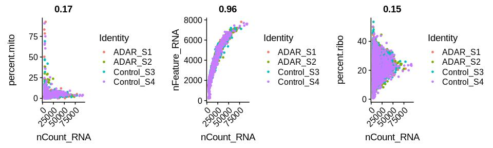

We observe that there are some cells in each treatment condition that have high levels of mitochondrial and ribosomal gene expression. We choose to filter out these cells, because they are likely to be dead or dying.

``` r
b16 <- subset(x = b16, subset = nFeature_RNA > 200 & nFeature_RNA < 8000 & percent.mito < 25 & percent.ribo < 40 )
```

I chose a threshold of 25% for mitochondrial genes and This threshold is just an approximation, and in some cases may not filter out all the truly dead/dying cells. If there are remaining dead/dying cells, they will often form their own subcluster, and can be removed using the later on using the subset() function. We can observe how many cells were filtered out by simply calling the object name and comparing with the output above.

``` r
b16
```

    ## An object of class Seurat
    ## 17190 features across 8755 samples within 1 assay
    ## Active assay: RNA (17190 features)

We observe that there are 8755 cells remaining, down from the original 8834.

Data normalization and clustering
---------------------------------

Now that we have created the Seurat object and performed some initial filtering of dead cells, we can move onto data normalization, clustering, and cell identification. These are all performed using the built-in functions `NormalizeData()`, `FindVariableFeatures()`, and `ScaleData()` within the Seurat R package, which are executed sequentially to process the object. Seurat objects are large and consume a lot of memory, so usually I continue to overwrite the same object at each step. The `ScaleData()` function typically takes a lot of computing power and a long time to run, so here I use the future package to speed things up with multicore processing. Essentially, these steps log-transform the expression values and scale each cell based its total read count (UMI) and mitochondrial / ribosomal percentage.

``` r
b16 <- NormalizeData(b16, normalization.method = "LogNormalize", scale.factor = 10000)
b16 <- FindVariableFeatures(b16, selection.method = "vst", nfeatures = 2000)
all.genes <- rownames(b16)
plan("multiprocess", workers = 4)
b16 <- ScaleData(b16, features = all.genes, vars.to.regress = c("nCount_RNA", "percent.mito", "percent.ribo"))
plan("multiprocess", workers = 1)
```

Once the values have been normalized and scaled, we can begin to cluster each cell based on their gene expression patterns. Our goal is that cells that express similar patterns of genes (high gene "X", low gene "Y", etc.) will cluster together. To do this, we use the `RunPCA()` function.

``` r
b16 <- RunPCA (b16, features = VariableFeatures(object = b16), ndims.print = 1:2)
```

    ## PC_ 1
    ## Positive:  Cryab, Dct, Tyrp1, Gxylt2, Pax3, Sox11, Insc, Pcbp4, Prdm16, Mlph
    ##     Mlana, Nedd4, Nckap5l, Cald1, Rab38, Plagl1, Aebp1, Syt4, Syngr1, Fam198b
    ##     Enho, Dnaic1, Deb1, Serpinh1, Fermt2, Tpd52l1, Limch1, Nfib, Rab34, Nckap1
    ## Negative:  Ctss, Ctsc, C1qc, C1qb, C1qa, Wfdc17, Ccl8, AW112010, Ms4a7, Cst3
    ##     Mrc1, Lpl, Lyz2, Fcgr4, Irf8, Trem2, Sepp1, Ccl2, Ccl6, Ccl7
    ##     Serpinb6a, Ctsl, Lgals3, Ccl9, Bst2, Plin2, Hmox1, Pf4, Folr2, Ly6a
    ## PC_ 2
    ## Positive:  H2afz, Cdca3, 2810417H13Rik, Hmgb2, Birc5, Tuba1b, Ezh2, Cks1b, Smc2, Knstrn
    ##     Ube2s, Cdca8, Cenpa, Lsm5, Ptma, Top2a, Ube2c, Dbf4, Lsm2, Mrpl18
    ##     Cenpm, Anp32b, Ccna2, Dut, Spc25, Insc, Prdm16, Tipin, Stmn1, Cenpf
    ## Negative:  Serping1, Bgn, Fstl1, Col3a1, Col1a1, Prkcdbp, Col1a2, Col5a2, Igfbp7, Fbn1
    ##     Col6a1, Rarres2, Prrx1, Serpinf1, Pcolce, C1s1, Loxl1, Adamts2, Sparc, Col6a2
    ##     Fkbp10, Col5a1, Nid1, Cyr61, Mmp23, Dcn, Postn, S100a16, Mfap5, Gpx8

The output above shows the genes that drive the variation for each of the principal components. We have the liberty of determining the number of PCs to choose for downstream clustering functions. Seurat uses graph-based cluster identification, and a common way of visualizing the clustering pattern is through t-distributed stochastic neighbor embedding (t-SNE). Both of these steps require us to input the number of PCs to use. To decide this number, we typically look at a scree plot:

``` r
ElbowPlot(object = b16, ndims = 50)
```

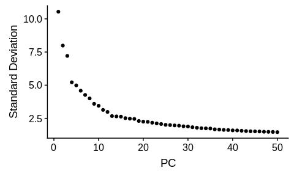

Here, I visually inspect the scree plot to determine how many PCs to choose, usually selecting a number at which the standard deviation "flattens" out, after which adding more PCs only mimimally reduces standard deviation. Here, I will choose 40 PCs. A more systematic way of choosing the PCs can be implemented, but from my experience, choosing PCs within 10% of this range has not impacted cluster identification. After choosing the number of PCs to use, we can run the clustering functions below:

``` r
b16 <- FindNeighbors(b16, dims = 1:40)
b16 <- FindClusters(b16, resolution = c(0.2, 0.4, 0.6))
b16 <- RunTSNE(b16, dims = 1:40)

# save the processed object now in case you want to come back to it later
# save(b16, file = "b16_all_v3.Robj")
```

The resolution parameter for the `FindClusters()` function is what you have to pay the most attention to. A higher resolution value will result in a larger number of clusters being identified, and vice versa. It dictates how over- or under- clustered your cells will be. Often times, you will have to try a bunch of different resolution values, examine how your cells cluster in each scenario, and determine which makes the most biological sense. You should ask yourself questions such as: do I observe cell clusters that are biologically distinct being aggregated with each other (e.g. NK cells and T cells being combined in the same cluster)? If so, your resolution is too low and should be higher. In contrast, if you observe multiple clusters of what appears to be the same cell type, you might have chosen too high of a resolution.

That being said, single-cell RNA-sequencing is great at detecting novel sub-populations of cells and revealing heterogeneity within what we previously may have thought to have been a single cell type. It is important to invest time into determining whether you are observing true biological heterogeneity vs. an artefact of choosing too high of a resolution. In my opinion, it is safer to choose a lower resolution to begin with, and then sub-cluster individual clusters of interest to determine whether there is any further heterogeneity that is biologically relevant. I will show an example of this later on in the analysis.

Here, we pass a vector of resolution values ranging from 0.2 to 0.6 to `FindClusters()`. We observe that the cluster attributions are defined as columns in `b16@meta.data` below. The field `b16@active.ident` houses the cluster definitions for the "right-most" resolution of 0.6.

``` r
head(b16@meta.data)
```

    ##                          orig.ident nCount_RNA nFeature_RNA percent.mito
    ## AAACCTGAGAAACGCC-ADAR_S1    ADAR_S1       7389         1530     3.992421
    ## AAACCTGAGCGCCTCA-ADAR_S1    ADAR_S1       5775         1757     2.354978
    ## AAACCTGAGTCGATAA-ADAR_S1    ADAR_S1      19273         4537     9.355056
    ## AAACCTGAGTGGCACA-ADAR_S1    ADAR_S1       8134         2609     3.184165
    ## AAACCTGCATGGTCAT-ADAR_S1    ADAR_S1      25503         4899     3.834843
    ## AAACCTGTCACATGCA-ADAR_S1    ADAR_S1      14388         3427     2.550737
    ##                          percent.ribo RNA_snn_res.0.2 RNA_snn_res.0.4
    ## AAACCTGAGAAACGCC-ADAR_S1     28.59656               5              12
    ## AAACCTGAGCGCCTCA-ADAR_S1     38.77056               7               9
    ## AAACCTGAGTCGATAA-ADAR_S1     21.44451               3               4
    ## AAACCTGAGTGGCACA-ADAR_S1     19.85493               2               6
    ## AAACCTGCATGGTCAT-ADAR_S1     23.99326               3               4
    ## AAACCTGTCACATGCA-ADAR_S1     22.28941               0               0
    ##                          RNA_snn_res.0.6 seurat_clusters
    ## AAACCTGAGAAACGCC-ADAR_S1              13              13
    ## AAACCTGAGCGCCTCA-ADAR_S1              10              10
    ## AAACCTGAGTCGATAA-ADAR_S1               4               4
    ## AAACCTGAGTGGCACA-ADAR_S1              11              11
    ## AAACCTGCATGGTCAT-ADAR_S1               4               4
    ## AAACCTGTCACATGCA-ADAR_S1               0               0

Now that clusters have been assigned, we can visualize the clustering patterns using the built-in Seurat function, `DimPlot()`, using the t-SNE dimensionality reduction option. The visualization functions within Seurat will utilize the clustering information from `active.ident` by default, unless the `group.by` parameter is specified. Below, I plot the t-SNE plot for each resolution. You can also swap the `active.ident` with any of the columns in the `meta.data` using the function `SetIdent()`.

``` r
r02 <- DimPlot(b16, label = T, reduction = "tsne", group.by = "RNA_snn_res.0.2")+labs(title="resolution 0.2")
r04 <- DimPlot(b16, label = T, reduction = "tsne", group.by = "RNA_snn_res.0.4")+labs(title="resolution 0.4")
r06 <- DimPlot(b16, label = T, reduction = "tsne", group.by = "RNA_snn_res.0.6")+labs(title="resolution 0.6")

CombinePlots(plots=list(r02,r04,r06), ncol = 3)
```

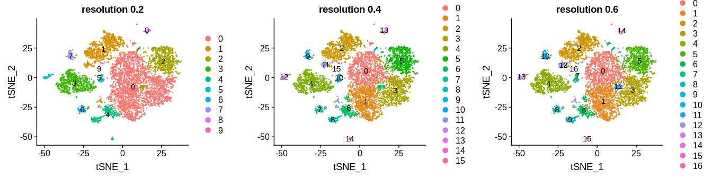

We observe that as the resolution factor increases, more clusters are shown, and that the biggest jump in the number of clusters occurs between resolution 0.2 and resolution 0.4. Often times, rare clusters with small numbers of cells will appear at higher resolutions. These rare clusters may have biological significance, and should be separated from other cell types when possible. For example, cluster 1 in resolution 0.2 appears to be a T cell cluster, but further separates into two clusters at a resolution of 0.4: a large cluster of CD8+ T cells (cluster 2, resolution 0.4) and a much smaller but distinct population of T-regulatory cells (cluster 11, resolution 0.4). I can make this judgement by examining the expression patterns of the genes CD8a, which defines CD8+ T cells, and Foxp3, which defines T-regulatory cells using a `FeaturePlot()` (expression of a gene overlaid on top of a t-SNE plot):

``` r
FeaturePlot(b16, c("Cd8a", "Foxp3"))
```

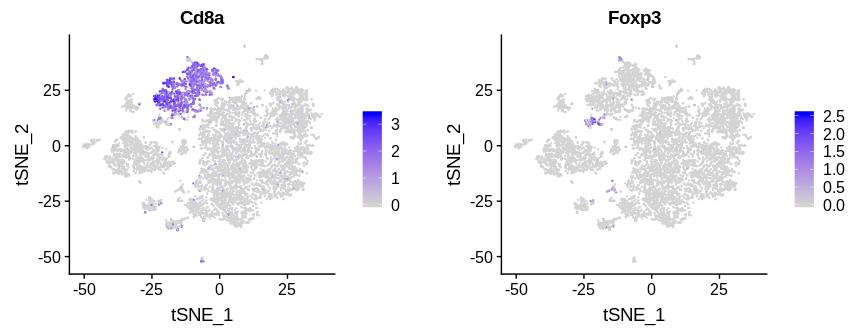

T-regulatory cells have vastly different functional properties compared to cytotoxic CD8+ T cells, and should definitely be given their own cluster definition. Based on this observation, I would determine 0.2 as too "low" of a resolution and choose either 0.4 or 0.6. Resolution 0.4 and 0.6 look very similar, except that cluster 6 from resolution 0.4 splits into clusters 6 and 11 in resolution 0.6. I will choose resolution 0.6 to work with for the rest of the analysis.

Identify cell types
-------------------

Aside from examining gene expression patterns using `FeaturePlot()`, a more in-depth way of identifying the cell types corresponding to each cluster can be performed by finding cluster-specific genes using the function `FindAllMarkers()`. This function will return the genes that are most highly upregulated in each cluster compared to all other clusters. We can then read through the top 30 genes for each cluster and use these genes to judge what cell type they define. This function also takes a long time to run, so I also use multicore processing for it. I have also provided a csv file with the top markers per cluster in the `output/` folder of this repo if you would like to look through it.

``` r
# determine cell type-specific markers using FindAllMarkers
plan("multiprocess", workers = 4)
b16.markers <- FindAllMarkers(b16, only.pos = TRUE, min.pct = 0.25, logfc.threshold = 0.25)
plan("multiprocess", workers = 1)

# save this to file in case you want to come back to it later
# save(b16.markers, file = "b16_all_markers_res06_v3.Robj")
```

``` r
top_markers_all <- b16.markers %>% group_by(cluster) %>% top_n(n = 10, wt = avg_logFC)
# write.csv(top_markers_all, file = "b16_all_markers_res06_v3.csv")
top_markers_all
```

    ## # A tibble: 170 x 7
    ## # Groups:   cluster [17]
    ##        p_val avg_logFC pct.1 pct.2 p_val_adj cluster gene  
    ##        <dbl>     <dbl> <dbl> <dbl>     <dbl> <fct>   <chr>
    ##  1 0.            1.23  0.886 0.324 0.        0       Lpl   
    ##  2 0.            1.08  0.988 0.622 0.        0       C1qc  
    ##  3 0.            1.08  0.931 0.395 0.        0       Ms4a7
    ##  4 0.            1.07  0.929 0.406 0.        0       Fcgr4
    ##  5 0.            1.01  0.987 0.613 0.        0       C1qa  
    ##  6 0.            0.996 0.735 0.211 0.        0       Cd72  
    ##  7 0.            0.959 0.99  0.683 0.        0       C1qb  
    ##  8 0.            0.937 0.717 0.172 0.        0       Slamf9
    ##  9 1.01e-289     0.847 0.988 0.88  1.74e-285 0       Pycard
    ## 10 6.63e-114     0.906 0.863 0.717 1.14e-109 0       Atp1b3
    ## # … with 160 more rows

Sifting through this table, we can assign cell types to each of the clusters. For example, the markers that define cluster "0" include C1qa and Ms4a7, which are described in the literature as canonical markers of tumor associated macrophages (TAMs). Cluster 1 is defined by high Ly6c2, Plac8, and Ccr2 expression which are all monocyte markers, so it is likely that these represent monocytes. Cluster 2 has high Cd8a, Cd8b1, and Gzmb expression, suggesting that these cells are CD8+ cytotoxic T cells. I use this same thought process to identify each of the remaining clusters in the dataset, and then store these designations in the variable `new.cluster.ids` below. I can use `RenameIdents()` to rename the clusters and then display the labels on top of each cluster on the t-SNE plot.

``` r
# res 0.6 cluster labels
new.cluster.ids <- c("0- TAM 1",
                     "1- Monocyte",
                     "2- CD8 T cell",
                     "3- TAM 2",
                     "4- Melanocyte",
                     "5- TAM 3",
                     "6- cDC2",
                     "7- Melanocyte",
                     "8- cDC1",
                     "9- Migratory DC",
                     "10- NK",
                     "11- TAM 4",
                     "12- Treg",
                     "13- Melanocyte",
                     "14- Fibroblast",
                     "15- pDC",
                     "16- TAM 5"
                     )
b16.labeled <- b16
names(new.cluster.ids) <- levels(b16.labeled)
b16.labeled <- RenameIdents(b16.labeled, new.cluster.ids)

DimPlot(b16.labeled, label = T, reduction = "tsne")
```

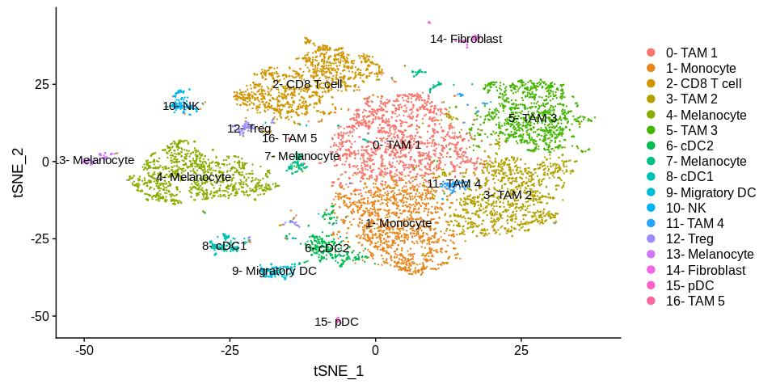

As expected, most of the cell types that come from similar origins cluster closely with one another. The different types of tumor associated macrophages (TAMs) seem to cluster near each other, likewise for the different types of dendritic cells.

Subsetting and reclustering
---------------------------

Since we are interested in the tumor immune infiltrate, it makes sense to remove all the non-immune cells in the dataset. According to the materials and methods section of the manuscript, B16 tumor cells were spiked in to the sample, which likely corresponds to the melanocyte clusters we defined above. We also observe a small population of fibroblasts (cluster 14) that can also be removed. We can double-check that these cells are non-immune cells by checking for Ptprc (CD45) expression.

``` r
FeaturePlot(b16.labeled, "Ptprc")
```

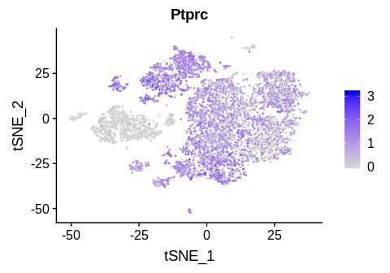

For a more quantitative view, we can plot a violin plot using the function `VlnPlot()`, which describes the overall expression of a gene across all clusters in the dataset:

``` r
VlnPlot(b16.labeled, "Ptprc", pt.size = 0.5)+NoLegend()
```

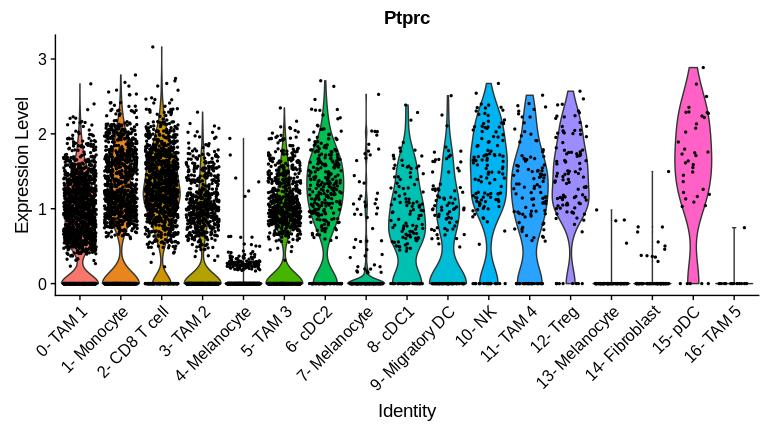

We observe that clusters 4, 7, 13, and 14 indeed have low CD45 expression. We can remove these cells using the `subset()` function. Although cluster 16 also has low CD45 expression, the genes that define this cluster very closely resemble a novel macrophage population called hemophagocytes (Akilesh et al. 2019), which in my opinion qualifies it for inclusion as an "immune cell" despite its low CD45 expression.

``` r
# remove non-immune cell clusters 4, 7, 13, 14
# since the cluster numbers start at 0 instead of 1, have to shift indicies by 1 in order to subtract the clusters from vector
b16 <- subset(b16, idents = c(0:16)[-c(5,8,14,15)])
DimPlot(b16, label = T, reduction = "tsne")
```

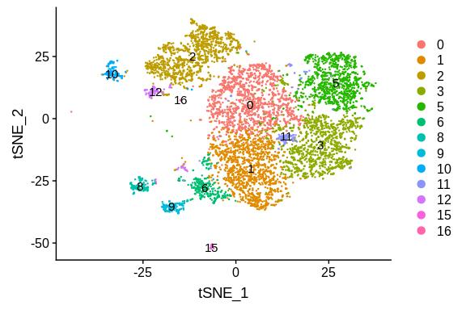

We observe that the non-immune cell clusters have been removed. Now we can re-run the normalization, scaling, and clustering functions.

``` r
# re-normalize and scale the object after removing the non-CD45+ clusters
b16 <- NormalizeData(b16, normalization.method = "LogNormalize", scale.factor = 10000)
b16 <- FindVariableFeatures(b16, selection.method = "vst", nfeatures = 2000)
all.genes <- rownames(b16)
plan("multiprocess", workers = 4)
b16 <- ScaleData(b16, features = all.genes, vars.to.regress = c("nCount_RNA", "percent.mito", "percent.ribo"))
plan("multiprocess", workers = 1)
b16 <- RunPCA (b16, features = VariableFeatures(object = b16))
b16 <- FindNeighbors(b16, dims = 1:40)
b16 <- FindClusters(b16, resolution = c(0.6))
b16 <- RunTSNE(b16, dims = 1:40)

# save the processed object now in case you want to come back to it later
# save(b16, file = "b16_immune_v3.Robj")
```

``` r
DimPlot(b16, label = T, reduction = "tsne")
```

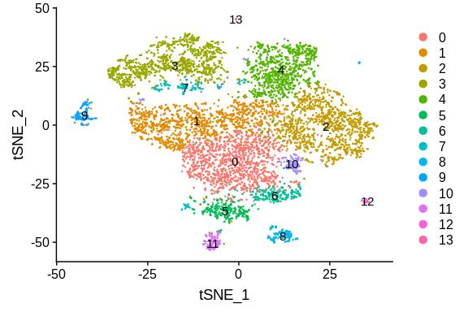

Aftwerwards, we can identify the cell types in the filtered, re-clustered object just as we did before, by first finding the cluster-specific markers using `FindAllMarkers()`:

``` r
plan("multiprocess", workers = 4)
b16.markers <- FindAllMarkers(b16, only.pos = TRUE, min.pct = 0.25, logfc.threshold = 0.25)
plan("multiprocess", workers = 1)

# save the markers in case you want to come back to it later
# save(b16.markers, file = "b16_immune_markers_res06_v3.Robj")
```

``` r
top_markers_immune <- b16.markers %>% group_by(cluster) %>% top_n(n = 10, wt = avg_logFC)
# write.csv(top_markers_immune, file = "b16_immune_markers_res06_v3.csv")
top_markers_immune
```

    ## # A tibble: 140 x 7
    ## # Groups:   cluster [14]
    ##        p_val avg_logFC pct.1 pct.2 p_val_adj cluster gene   
    ##        <dbl>     <dbl> <dbl> <dbl>     <dbl> <fct>   <chr>  
    ##  1 0.            1.14  0.868 0.389 0.        0       Ms4a4c
    ##  2 1.24e-301     1.01  0.987 0.756 2.14e-297 0       Cd74   
    ##  3 1.13e-299     1.07  0.901 0.507 1.95e-295 0       H2-DMb1
    ##  4 5.70e-286     1.10  0.963 0.725 9.79e-282 0       H2-Ab1
    ##  5 6.78e-246     1.26  0.716 0.3   1.17e-241 0       Il1b   
    ##  6 7.11e-211     0.997 0.831 0.491 1.22e-206 0       Isg15  
    ##  7 1.11e-202     0.988 0.792 0.453 1.91e-198 0       Gbp2   
    ##  8 7.45e-196     1.23  0.654 0.288 1.28e-191 0       Cxcl9  
    ##  9 4.03e-171     1.04  0.675 0.315 6.94e-167 0       Ly6c2  
    ## 10 8.54e-128     1.38  0.559 0.271 1.47e-123 0       Cxcl10
    ## # … with 130 more rows

You can find the marker files in the `output/` folder of this repo. Using the marker list, we can assign cell types to each cluster:

``` r
new.cluster.ids <- c("0- Classical Monocyte",
                     "1- TAM 1",
                     "2- TAM 2",
                     "3- CD8 T cell",
                     "4- TAM 3",
                     "5- cDC2",
                     "6- Patrolling Monocyte",
                     "7- Treg",
                     "8- cDC1",
                     "9- NK cell",
                     "10- TAM 4",
                     "11- Migratory DC",
                     "12- pDC",
                     "13- TAM 5"
                     )
b16.labeled <- b16
names(new.cluster.ids) <- levels(b16.labeled)
b16.labeled <- RenameIdents(b16.labeled, new.cluster.ids)

DimPlot(b16.labeled, label = T, reduction = "tsne")
```

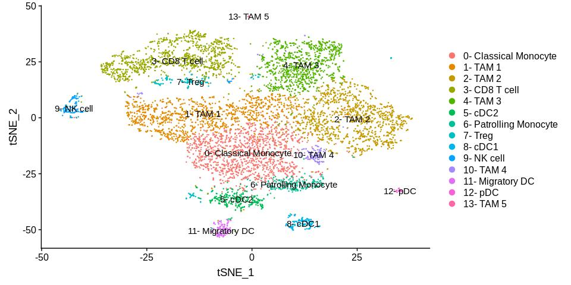

We observe a similar set of cell types as before, except that the monocytes have now split up into two groups. Based on the gene expression that define each group, there appears to be an activated population (cluster 0) and an unactivated population (cluster 6).

The clusters are by default ordered by cell abundance, which makes looking at some of the visualizations complicated. It makes more intuitive sense to lump the labels for each cell type together (all monocytes together, all tams together, etc). You can reorder the clusters by manually specifying the order in the levels parameter of `factor()`:

``` r
# reorder by cell type:
reordered.new.cluster.ids <- c("0- Classical Monocyte",
                               "6- Patrolling Monocyte",
                               "1- TAM 1",
                               "2- TAM 2",
                               "4- TAM 3",
                               "10- TAM 4",
                               "13- TAM 5",
                               "8- cDC1",
                               "5- cDC2",
                               "11- Migratory DC",
                               "12- pDC",
                               "3- CD8 T cell",
                               "7- Treg",
                               "9- NK cell"
                              )

b16.labeled@active.ident <- factor (b16.labeled@active.ident, levels = reordered.new.cluster.ids)

DimPlot(b16.labeled, label = T, reduction = "tsne")
```

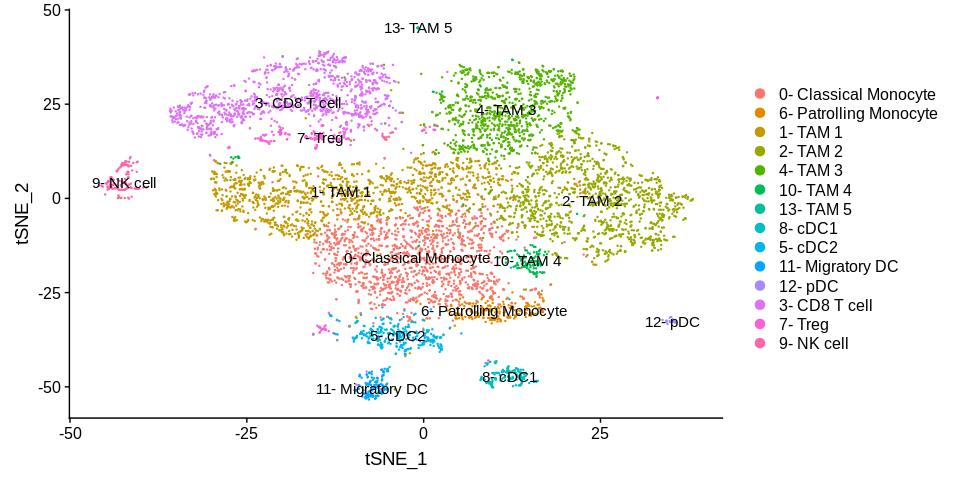

If desired, clusters can be also combined by naming them with the exact same names using `RenameIdents()`. This type of aggregation can be performed when you wish to lump common cell types together. It is useful when you want to gain a high-level overview of the cellular composition of the dataset.

``` r
combined.cluster.ids <- c("Monocyte",
                     "TAM",
                     "TAM",
                     "CD8",
                     "TAM",
                     "cDC2",
                     "Monocyte",
                     "Treg",
                     "cDC1",
                     "NK",
                     "TAM",
                     "Migratory DC",
                     "pDC",
                     "TAM"
                     )
b16.combined <- b16
names(combined.cluster.ids) <- levels(b16.combined)
b16.combined <- RenameIdents(b16.combined, combined.cluster.ids)

# reorder the clusters based on myeloid and lymphoid
b16.combined@active.ident <- factor(b16.combined@active.ident, levels = c("TAM", "Monocyte", "cDC1", "cDC2", "pDC", "Migratory DC", "CD8", "Treg", "NK"))
# store the aggregated clustering information in the meta.data
b16.combined[["res06_aggregated"]] <- b16.combined@active.ident
```

Using this method, these aggregated cluster designations are stored in the `active.ident` portion of the seurat object. We can also store this information in the `meta.data` in case we want to switch back and forth between the other clustering resolutions. The functions in Seurat will by default access `active.ident`, so they all still work as expected, now displaying fewer clusters in the aggregated object:

``` r
DimPlot(b16.combined, label = T, reduction = "tsne")
```

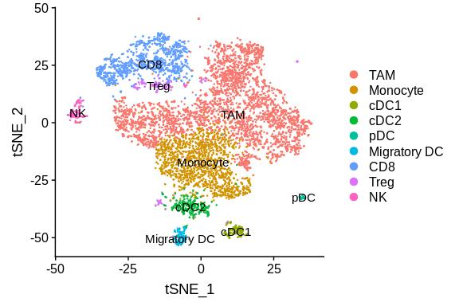

We can again obtain the markers for each of the aggregated cell types in the dataset:

``` r
plan("multiprocess", workers = 4)
b16.markers <- FindAllMarkers(b16.combined, only.pos = TRUE, min.pct = 0.25, logfc.threshold = 0.25)
plan("multiprocess", workers = 1)

# save the markers now in case you want to come back to it later
# save(b16.markers, file = "b16_aggregate_markers_res06_v3.Robj")
```

``` r
top_markers_aggregate <- b16.markers %>% group_by(cluster) %>% top_n(n = 10, wt = avg_logFC)
# write.csv(top_markers_aggregate, file = "b16_aggregate_markers_res06_v3.csv")
top_markers_aggregate
```

    ## # A tibble: 90 x 7
    ## # Groups:   cluster [9]
    ##        p_val avg_logFC pct.1 pct.2 p_val_adj cluster gene  
    ##        <dbl>     <dbl> <dbl> <dbl>     <dbl> <fct>   <chr>
    ##  1 0.             2.32 0.843 0.285 0.        TAM     Pf4   
    ##  2 0.             2.24 0.912 0.618 0.        TAM     Apoe  
    ##  3 0.             2.23 0.863 0.461 0.        TAM     Sepp1
    ##  4 0.             1.76 0.869 0.499 0.        TAM     Ccl8  
    ##  5 0.             1.73 0.977 0.704 0.        TAM     Wfdc17
    ##  6 0.             1.68 0.888 0.364 0.        TAM     Hmox1
    ##  7 0.             1.68 0.802 0.245 0.        TAM     Timp2
    ##  8 0.             1.63 0.843 0.336 0.        TAM     Ctsl  
    ##  9 3.44e-215      1.75 0.403 0.096 5.91e-211 TAM     Arg1  
    ## 10 6.19e-171      2.31 0.324 0.072 1.06e-166 TAM     Saa3  
    ## # … with 80 more rows

At this point, we are finished "processing" our Seurat object. We can start performing some visualizations in order to gain insight from the data, which I will go over in the next few sections.

------------------------------------------------------------------------

Built-in Seurat Visualizations
------------------------------

Seurat has a suite of built-in visualization functions for plotting cell composition and expression of genes across clusters. We can start to answer questions such as:

-   Which cell types express gene X?
-   What percent of each cell type is represented in the dataset?
-   How do the percentages change in the ADAR1 KO tumors compared to the Control tumors?

I will first showcase the basic built-in visualizations that come with the Seurat package. Then, I go more in-depth into various types of visualizations and data mining that can be performed on this processed Seurat object. For the purposes of this demonstration, I will be using the version of the Seurat object in which I've aggregated the clusters by cell type.

### 1. FeaturePlot

The `FeaturePlot()` is one of the most useful functions for determining gene expression patterns in your dataset. This, used in conjunction with the t-SNE plot, can be used side-by-side to visually assess which cell types express a given gene.

``` r
fp <- FeaturePlot(b16.combined, "Ccr2", pt.size = 0.6)
tp <- DimPlot(b16.combined, pt.size = 0.6, label = T, reduction = "tsne")
CombinePlots(plots = list(tp,fp))
```

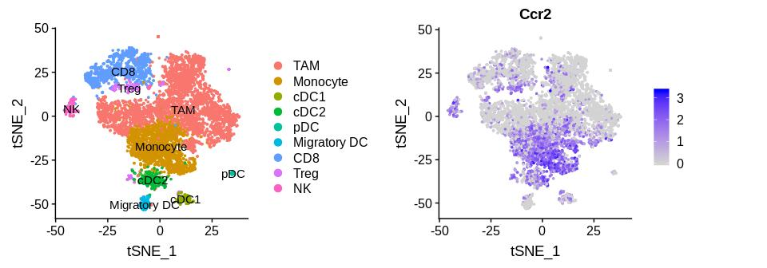

In the example above, we observe that the chemokine receptor Ccr2 is expressed by cells in the monocyte cluster, as expected based on the literature. The beauty of single-cell RNA-seq is that we can also assess the expression of this receptor in all the other cell types as well. Visually, we can observe that Tregs, NK cells, and cDC2 also express Ccr2 to a high degree. Furthermore, you can plot two genes on top of the same plot by setting `blend = T`. This allows for some interesting comparisons to be made between pairs of genes that may have biological significance.

``` r
FeaturePlot(b16.combined, c("Ccl2", "Ccr2"), blend = T)
```

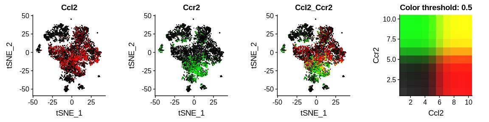

In this case, I plot Ccr2 with its ligand, Ccl2. This gives me insight into which cells express the ligand for Ccl2, and which cells have its receptor, Ccr2. It is likely that Ccr2+ cells (monocytes, Tregs, etc.) will migrate into proximity with Ccl2+ cells, which appear to be tumor associated macrophages.

### 2. VlnPlot

The `FeaturePlot()` above are nice to make a visually compelling argument, but it is necessary to quantitate the amount of signal observed in each cluster. To do this, we can plot a "violin plot" using the built-in function `VlnPlot()`, which will display the expression of a given gene in each of the clusters in `active.ident`.

``` r
VlnPlot(b16.combined, "Ccr2", pt.size =0.1)
```

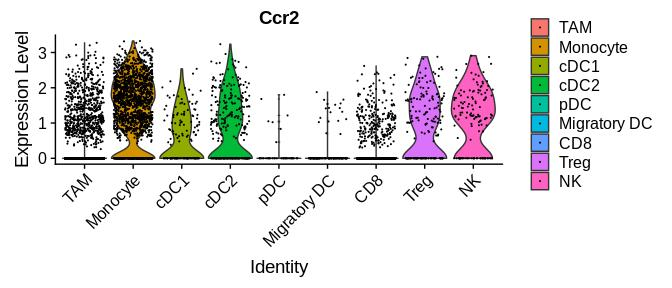

The width of the violin plot is a measure of the proportion of cells at the corresponding expression level. We observe that the monocyte cluster expresses the highest level of Ccr2.

### 3. RidgePlot

An alternative to the `VlnPlot()` is the `RidgePlot()`, which you can think of as flipping the violin plot on its side. This provides a density histogram that displays the magnitude and proportion of cells that express the gene for each cluster. Those who are used to looking at flow cytometry histograms may enjoy this type of plot more.

``` r
RidgePlot(b16.combined, "Ccr2")
```

    ## Picking joint bandwidth of 0.136

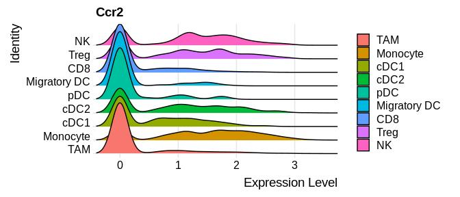

### 4. DotPlot

If you wish to compare the expression of several genes at the same time across all clusters, the `DotPlot()` is a very useful way of doing so. The size of the dots in the plot correspond do the percentage of cells within the cluster that are positive for expression (have an expression value &gt; 0). The color of the dot represents the magnitude of expression of the cells that are positive (i.e. do they express high levels, or low levels of the gene relative to other clusters?).

``` r
cluster_specific_genes <- c("C1qa", "Apoe","Ly6c2", "Ccr2", "Xcr1", "Clec9a", "Cd209a", "Clec4a4", "Siglech", "Ccr9", "Ccr7", "Fscn1", "Cd8a", "Cd3e", "Foxp3", "Il2ra", "Ncr1", "Klra4")

# can use a RColorBrewer pallete, I chose RdBu here
DotPlot(b16.combined, features = rev(cluster_specific_genes), cols = "RdBu", plot.legend = T)+
  theme(axis.text.x = element_text( angle = 90, vjust = 0.5, hjust = 1))
```

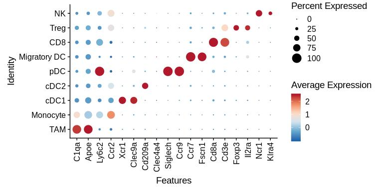

Here, I chose to plot some genes that are described in the literature to be specific to each cell type defined in our dataset. We observe that most of the genes are indeed specifically expressed by their cell types, with the exception of Ly6c2, which we observe to be expressed at the highest level in pDCs rather than monocytes.

We can also use the dot plot to make knockout vs wildtype comparisons in this dataset. In the example below, I can subset on a specific group (in this case, CD8 T cells) and then assess the activation / exhaustion level in CD8 T cells from the KO vs WT samples using a DotPlot. These genes were obtained from Carmona et al. 2019 (<https://www.biorxiv.org/content/10.1101/800847v1>).

``` r
# subset just the CD8 cluster
cd8 <- subset(b16.combined, idents = "CD8")

# set the clustering identity back to the original sample origin, "orig.ident"
cd8 <- SetIdent(cd8, value = "orig.ident")

t_cell_genes <- c("Entpd1","Havcr2", "Tigit", "Lag3","Pdcd1", "Batf","Tox","Id2","Ccl3","Prf1", "Fasl", "Gzmb","Gzmk",  "Ifng", "Ccl5","Ly6c2", "Cd69",  "Cxcr3", "Cd44", "Tcf7", "Ccr7", "S1pr1", "Lef1", "Il7r", "Sell")

DotPlot(cd8, features = rev(t_cell_genes), cols = "RdBu", plot.legend = T)+
  theme(axis.text.x = element_text( angle = 90, vjust = 0.5, hjust = 1))
```

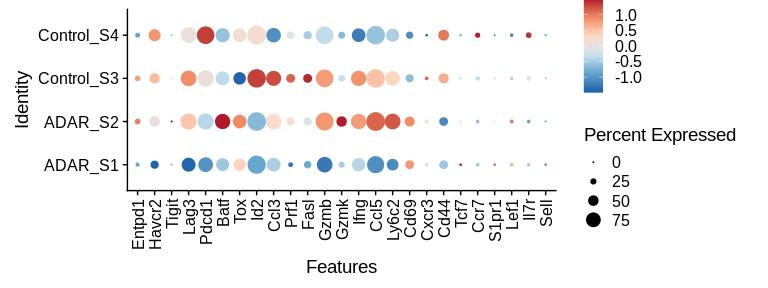

We observe clear heterogeneity between the CD8 T cells isolated from each of the different samples. The genes between Entpd1 and Id2 represent T cell exhaustion genes, between Ccl3 and Cd69 represent T cell activation genes, and between Cxcr3 and Sell represent naive/memory T cell genes. Control\_S3 and ADAR\_S2 have a greater T cell activation signature compared to the other two samples, with higher levels of Gzmb, Ifng, Ccl5, and Ly6c2 expression. It does not appear that the activation signature correlates with the ADAR1 KO samples, since both the control and ADAR1 KO groups have a sample that displays this phenotype. However, there are some exceptions, such as CD69 that appears to be higher in both ADAR1 KO samples and lower in both Control samples.

### 5. Heatmap

A way to examine a large set of genes on a per-cell basis is by heatmap, using `DoHeatmap()`. Each column of the heatmap represents a single cell, organized by cluster. Each row of the heatmap represents a gene from the marker list you input, which typically is also organized by cluster. We can input the top set of markers from `FindAllMarkers()` into Seurat's built-in heatmap function, `DoHeatmap()`. This results in a "diagonal" heatmap in which you can view how enriched each cluster-specific set of genes is for each cluster. You can also use this heatmap to visualize how your expression of your own genes of interest are spread across the clusters.

``` r
# b16.markers is the output from running FindAllMarkers()
top_b16_markers <- b16.markers %>% group_by(cluster) %>% top_n(n = 5, wt = avg_logFC)

DoHeatmap(b16.combined, cells = WhichCells(b16.combined, downsample = 50, seed = 1), features = top_b16_markers$gene, size = 3.5, angle = 15, hjust =0)
```

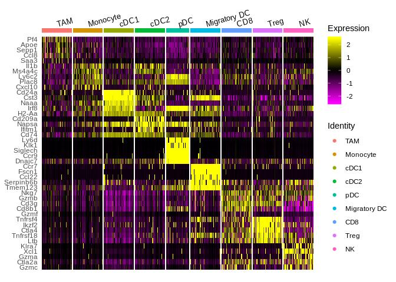

We observe that a lot of "cluster-specific" genes from `FindAllMarkers()` are actually expressed at varying levels by multiple cell types. For example, scanning from left to right for Irf8, which was determined to be a cDC1-specific gene, is enriched in both cDC1s as well as in pDCs and Migratory DCs. In contrast, a lot of the genes for pDCs appear to be exclusive to this cell type, in which almost no yellow signal is observed in any bin other than the pDC cluster.

### 6. FeatureScatter

The `FeatureScatter()` function can be used to assess the correlation between two genes within a cluster. For example, we can examine how CD8+ T-cell activation genes such as Gzmb are correlated with exhaustion genes such as Tox.

``` r
FeatureScatter(cd8, "Tox", "Gzmb")+
  geom_smooth(method = "lm", se = F)
```

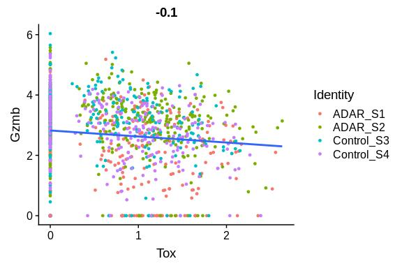

As expected, we observe that these two genes are negatively correlated. T cells which express more Tox are likely to be more exhausted, and these cells also tend to express less Gzmb.

Custom Visualizations
---------------------

Below are some functions and analysis methods that I wrote to supplement the built-in visualization methods in Seurat. These visualizations help answer questions such as:

-   What proportion of total cells does each cluster represent, and how does this look across KO/Control groups?
-   What proportion of cells are high or low for a gene?
-   What is the expression of a gene signature across cells?
-   Which samples are most similar to each other based on cell composition?
-   What biological pathways are enriched in one group vs another group of cells?

### 1. Cell proportion plot

It is often helpful to determine what proportion of total cells each cell cluster represents. Given a seurat object, the function `plot_proportions()` below will plot a bargraph showing the % of total cells for each cluster. It will pull from the `active.ident` slot.

``` r
plot_proportions <- function (seuratobj){
  proportions <- table(seuratobj@active.ident)/length(seuratobj@active.ident)*100
  proportions <- as.data.frame(proportions)
  ggplot(proportions , aes (x = Var1, y = Freq))+
    geom_bar(stat = "identity", aes(fill = Var1))+
    theme_classic()+
    labs (x = NULL, y = "Percent of total cells", title = "Cell abundance by cluster")+
    theme(axis.text.x = element_text(angle = 45, hjust = 1, size = 12, color = "black"),
          axis.text.y = element_text(size = 12, color = "black"),
          axis.title.y = element_text(size = 12),
          legend.position = "none")
}

plot_proportions(b16.combined)
```

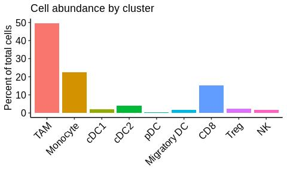

We observe that the majority of cells are TAMs, followed by monocytes and CD8 T cells. If you are interested in how the proportions are represented across each individual ADAR1 KO and Control sample, see the function `plot_group_proportions()` in the group-wise analysis section below.

### 2. UMI / nCount\_RNA plot

A good way to QC your data is to check how many total unique molecular identifiers (transcripts) are in each cell, as a proxy for how transcriptionally active the cell is. This is often referred to as "UMI count" or "nCount\_RNA". To do this, we can extract the nCount\_RNA from the `meta.data`, and then plot the gradient on top of a t-SNE plot. The function `umi_plot()` will do this as shown below:

``` r
umi_plot <- function (seuratobj) {
  # extract the t-sne coordinates
  seuratobj[["tsne1"]] <-  Embeddings(object = seuratobj, reduction = "tsne")[,"tSNE_1"]
  seuratobj[["tsne2"]] <-  Embeddings(object = seuratobj, reduction = "tsne")[,"tSNE_2"]
  ggplot(seuratobj@meta.data, aes (x = tsne1, y = tsne2 ))+
    geom_point(aes(color = log(nCount_RNA)))+
    scale_color_gradientn(colors = viridis::magma(10))
}

umi_plot(b16.combined)
```

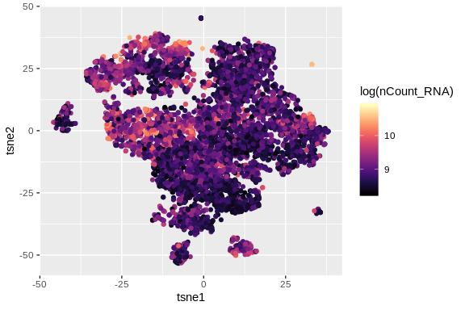

We observe that the highest number of transcripts are found in the CD8 T cell cluster and the TAM 1 macrophage cluster. If there is a dead cell cluster, usually it will have the lowest number of transcripts. To get a better grasp on a per-cluster basis, we can use dplyr to summarize the average UMI/nCount\_RNA grouped by cluster. We can also summarize other items of interest such as the average nFeature, percent.mito, etc, using the function `summarize_metadata()` below:

``` r
summarize_metadata <- function (seuratobject, group.by = "RNA_snn_res.0.6") {
  seuratobject@meta.data %>%
    group_by_at(group.by) %>%
    summarise (avg_UMI = mean(nCount_RNA),
               avg_nFeature = mean(nFeature_RNA),
               avg_percent.mito = mean(percent.mito),
               avg_percent.ribo = mean(percent.ribo)) %>%
    arrange(desc(avg_UMI))
}

summarize_metadata(b16.combined, group.by = "RNA_snn_res.0.6")
```

    ## # A tibble: 14 x 5
    ##    RNA_snn_res.0.6 avg_UMI avg_nFeature avg_percent.mito avg_percent.ribo
    ##    <fct>             <dbl>        <dbl>            <dbl>            <dbl>
    ##  1 1                11630.        2799.            3.75             18.4
    ##  2 8                10753.        2554.            2.31             24.9
    ##  3 7                10687.        2697.            2.58             24.7
    ##  4 3                10419.        2620.            2.65             29.9
    ##  5 10                7942.        2170.            3.72             19.8
    ##  6 2                 7887.        2069.            2.30             16.4
    ##  7 11                7829.        2043.            1.85             20.0
    ##  8 4                 7374.        2161.            5.04             14.7
    ##  9 0                 7324.        2124.            2.58             16.1
    ## 10 5                 7115.        2082.            2.02             23.0
    ## 11 9                 6981.        2046.            2.54             31.7
    ## 12 13                5887.         464.            0.272             2.82
    ## 13 12                5455.        1858.            3.66             21.3
    ## 14 6                 5202.        1752.            2.08             20.6

### 3. Signature plot

Although FeaturePlots are useful for determining the expression of a single gene across the single-cell dataset, we might be interested in how a gene signature (multiple genes in aggregate) behave. For example, there are many genes that contribute to T cell exhaustion. To do this, we have to make an aggregate metric composed of the expression values of all of the genes in our signature, and then overlay this aggregate metric ontop of the t-SNE plot, using the `signature_plot()` function below:

``` r
signature_genes <- c("Havcr2", "Tigit", "Lag3","Pdcd1","Tox")

signature_plot <- function (seuratobject,signature_genes){
  sig_data <- as.data.frame(Embeddings(object = seuratobject, reduction = "tsne"))
  sig_data$signature <- rowMeans(t(seuratobject@assays$RNA@scale.data[signature_genes,]))
  ggplot(sig_data, aes (tSNE_1, tSNE_2))+
    geom_point(aes (color = signature))+
    scale_color_gradientn(colors = topo.colors(8))+
    theme_classic()
}

signature_plot(b16.combined, signature_genes)
```

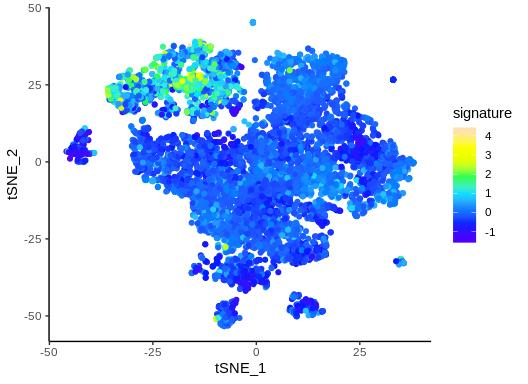

### 4. Identify cells by barcode

Sometimes, I want to zoom in on a subcluster of cells and re-cluster them in order to determine what further heterogeneity exists within that cluster. After doing so, I often want to determine where sub-clusters lie in the original t-SNE plot. You can pull out individual cell barcodes by either using the function `WhichCells()`, or by simply taking the rownames of the `meta.data` corresponding to the cells you want. Below, is an example where I further subcluster the CD8 T cell cluster and pull out of the new subclusters' barcodes:

``` r
# isolate cd8 from the main object
cd8 <- subset(b16.combined, idents = "CD8")

# re-cluster only the cd8 T cells
cd8 <- FindNeighbors(cd8, dims = 1:40)
cd8 <- FindClusters(cd8, resolution = c(0.2))
```

``` r
DimPlot(cd8, label = T, reduction = "tsne")
```

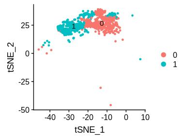

We observe that the original CD8 cluster is now split into two. We can access the barcodes for cluster 1 using `WhichCells()`:

``` r
cd8_cluster1_barcodes <- WhichCells(cd8, idents = 1)
```

I now use the barcodes to identify the cells on graphs such as the t-SNE plot:

``` r
# highlight the cells using cells.highlight
ta <- DimPlot(b16, label = T, cells.highlight = cd8_cluster1_barcodes, reduction = "tsne") + labs(title = "Using cells.highlight")

# or identify the cells manually in the meta.data (better if you need to store this information for future use)
b16@meta.data$cd8_cluster1 <- ifelse(rownames(b16@meta.data) %in% cd8_cluster1_barcodes, TRUE, FALSE)
tb <- DimPlot(b16, group.by = "cd8_cluster1", reduction = "tsne") + labs(title = "Adding to meta.data \n and using group.by")

CombinePlots(plots = list(ta, tb))
```

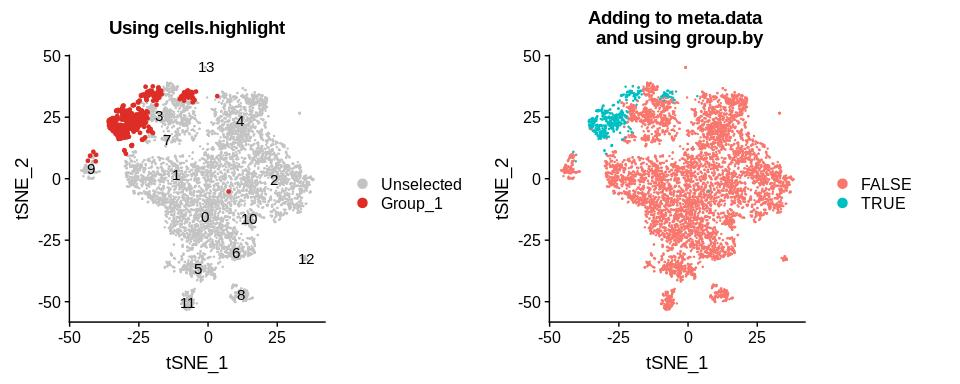

Instead of using the subset function, you can also manually pull out barcodes based on the coordinates of the cells in the t-SNE graph. This is often useful when you are interested in a small population of cells in a specific area of the t-SNE graph that are not separated by the conventional clustering algorithms. Once you have the barcodes, you can even re-assign some of the `active.ident` values to a new cell type, and then find markers that are enriched in these barcodes `using FindMarkers()`. For example, we might be interested in knowing what the few cells in the top right-hand corner are.

``` r
b16[["tsne1"]] <-  Embeddings(object = b16, reduction = "tsne")[,"tSNE_1"]
b16[["tsne2"]] <-  Embeddings(object = b16, reduction = "tsne")[,"tSNE_2"]

top_right_barcodes <- rownames(b16@meta.data)[which(b16@meta.data$tsne1 > 25 & b16@meta.data$tsne2 > 25)]
top_right_barcodes
```

    ##  [1] "CAGAGAGGTTGGTGGA-Control_S3" "GTACGTAGTGATGATA-Control_S3"
    ##  [3] "TGGGAAGAGTGCAAGC-Control_S4" "CCCAATCTCGGTGTTA-ADAR_S2"   
    ##  [5] "TGTCCCATCATGTCCC-Control_S3" "TACAGTGAGCGTGAGT-Control_S3"
    ##  [7] "CTTACCGCATATACCG-ADAR_S1"    "TAAGAGAAGAATTCCC-ADAR_S1"   
    ##  [9] "GATGAAACACCCTATC-ADAR_S2"    "TGGTTCCCATACTACG-Control_S3"
    ## [11] "ACTTACTTCACAGTAC-Control_S4" "GATGAGGCACTTAACG-Control_S4"
    ## [13] "GTTCTCGTCCATGAGT-Control_S4"

After pulling out the barcodes, we observe that this small island is madde up of 13 cells. We verify that we've pulled out the right cells by identifying them in the t-SNE plot:

``` r
DimPlot(b16, cells.highlight = top_right_barcodes, reduction = "tsne")
```

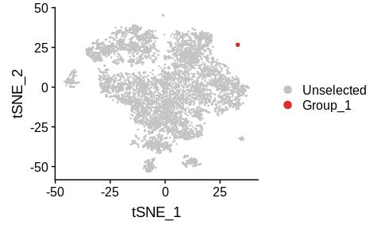

We can now assign these 13 cells a new "ident" within `active.ident`, and then find the markers that define this small cluster of cells using `FindMarkers()`:

``` r
# add barcodes to the active.ident as a new cluster called unknown
levels(b16.combined@active.ident) <- c(levels(b16.combined@active.ident), "unknown")
b16.combined@active.ident[top_right_barcodes] <- "unknown"
```

The cluster named "unknown" now shows up in `active.ident`, as well as most Seurat visualizations such as DimPlot:

``` r
table(b16.combined@active.ident)
```

    ##
    ##          TAM     Monocyte         cDC1         cDC2          pDC
    ##         3651         1642          148          296           39
    ## Migratory DC          CD8         Treg           NK      unknown
    ##          131         1130          165          137           13

``` r
DimPlot(b16.combined, label = T, reduction = "tsne")
```

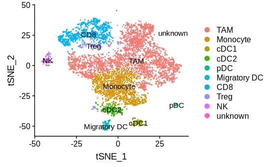

This means that we can now call `FindMarkers()` on the object and specify it to return markers for the cluster named "unknown":

``` r
unknown_markers <- FindMarkers(b16.combined, "unknown")
#save(unknown_markers, file = "unknown_cluster_markers.Robj")
```

``` r
unknown_markers[order(unknown_markers$avg_logFC, decreasing = T)[1:10],]
```

    ##                p_val avg_logFC pct.1 pct.2    p_val_adj
    ## Dct     1.669101e-24  2.744085     1 0.142 2.869185e-20
    ## Tyrp1   4.441142e-19  2.521289     1 0.197 7.634324e-15
    ## Mlana   1.265320e-19  2.325679     1 0.190 2.175085e-15
    ## Cryab   3.423347e-29  2.153213     1 0.114 5.884734e-25
    ## Syngr1  2.885726e-17  2.145888     1 0.228 4.960563e-13
    ## Hmgn1   5.508614e-11  1.944009     1 0.505 9.469308e-07
    ## Deb1    5.467299e-14  1.744744     1 0.289 9.398286e-10
    ## Ptgds   1.511600e-31  1.723832     1 0.099 2.598441e-27
    ## Chchd10 4.450304e-12  1.723592     1 0.381 7.650073e-08
    ## Gpnmb   5.590218e-14  1.687236     1 0.268 9.609586e-10

Based on the `FindMarkers()` result, the 13 cells that make up the unknown cluster look like a non-immune cell type. Perhaps these cells were not captured with other non-immune cell types when we first filtered those clusters out, or they could be a small population of doublets.

Now that we are done with this analysis, we can restore the `active.ident` of `b16.combined` back to its original state, using the aggregated cluster designations that we had previously stored in the `meta.data` under the column name "res06\_aggregated".

``` r
# restore the original active.ident of b16.combined
b16.combined <- SetIdent(b16.combined, value = "res06_aggregated")
```

### 5. Percent of positive cells by cluster

Sometimes, it's useful to know how many cells express a given gene at any level (i.e. have any expression value greater than 0). The function `get_percent_positive()` finds the proportion of cells within specified clusters that are positive for a given marker. It does so using a simple `ifelse()` statement.

``` r
get_percent_positive <- function(seuratobj, marker, idents = "all"){
  seuratobj@meta.data$markerpos <- ifelse(seuratobj@assays$RNA@data[marker,] > 0, 1, 0)
  seuratobj@meta.data$active.ident <- as.character(seuratobj@active.ident)
  if (idents != "all")
    seuratobj@meta.data$active.ident[!(seuratobj@meta.data$active.ident %in% idents)] <- "Other"
  summary_data <- seuratobj@meta.data %>%
    group_by(active.ident) %>%
    summarize (proportion_cd45 = n()/nrow(seuratobj@meta.data)*100,
               proportion_markerpos = mean(markerpos)*100)
  summary_data
}

get_percent_positive(b16.combined, "Ccr2")
```

    ## # A tibble: 9 x 3
    ##   active.ident proportion_cd45 proportion_markerpos
    ##   <chr>                  <dbl>                <dbl>
    ## 1 CD8                   15.4                   23.2
    ## 2 cDC1                   2.01                  52.0
    ## 3 cDC2                   4.03                  60.8
    ## 4 Migratory DC           1.78                  13.7
    ## 5 Monocyte              22.3                   80.0
    ## 6 NK                     1.86                  71.5
    ## 7 pDC                    0.530                 17.9
    ## 8 TAM                   49.7                   19.3
    ## 9 Treg                   2.42                  64.0

As expected, we observe that the highest proportion of Ccr2+ cells are observed in the Monocyte cluster. If we want to focus specifically on one or two clusters, we can specify them as an argument and the other cell types will be lumped as an "Other" category:

``` r
get_percent_positive(b16.combined, "Ccr2", c("pDC", "CD8", "Monocyte"))
```

    ## # A tibble: 4 x 3
    ##   active.ident proportion_cd45 proportion_markerpos
    ##   <chr>                  <dbl>                <dbl>
    ## 1 CD8                   15.4                   23.2
    ## 2 Monocyte              22.3                   80.0
    ## 3 Other                 61.8                   26.2
    ## 4 pDC                    0.530                 17.9

We can also generate a simple visualization of this data using a barplot, displaying the percentage positive for each cell type:

``` r
plot_percent_positive <- function (seuratobj, marker, idents = "all") {
  summary_data <- get_percent_positive(seuratobj, marker, idents)
  ggplot(summary_data, aes(x = active.ident, y = proportion_markerpos))+
    geom_bar(aes(fill = active.ident),stat = "identity")+
    labs (y = paste("Percent positive for", marker),
          x = "Cell Type")+
    theme(axis.text.x = element_text(angle = 45, hjust=1))
}
plot_percent_positive(b16.combined, "Ccr2")
```

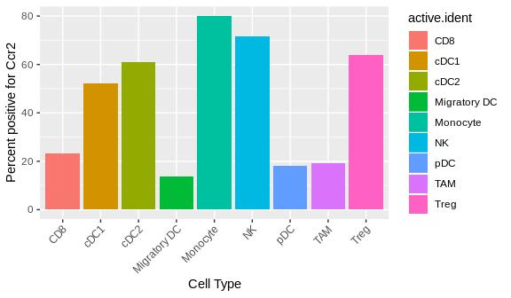

### 6. Median splitting by gene

Even within a cell type, there is often a range of expression of certain genes, from high to low. For example, CD8 T cells may express high to low levels of exhaustion markers such as PD1 (gene name Pdcd1). They all still qualify as CD8 T cells, but the PD1-high cells may behave different from PD1-low cells. This distinction can be important, and so we should have a way to analytically identify the cells that are high or low for a given gene. To do this, we can calculate the median gene expression and categorize each cell using an `ifelse()` statement. The function `tsne_median_split()` below will identify and plot the high vs low expressors for a given gene.

``` r
cd8 <- subset(b16.combined, idents = "CD8")

median_split <- function (seuratobj, gene, method = "plot") {
  gene_expression <- seuratobj@assays$RNA@data[gene,]
  median_split <- factor (ifelse(gene_expression>=median(gene_expression), str_c(gene,"-high"), str_c(gene,"-low")))
  split_name <- str_c(gene, ".split")
  seuratobj[[split_name]] <- median_split
  if (method == "plot") {
    DimPlot(seuratobj, group.by = split_name, reduction = "tsne")
  } else if (method == "differential genes") {
    seuratobj <- SetIdent(seuratobj, value = split_name)
    de_results <- FindMarkers(seuratobj, str_c(gene,"-high"), str_c(gene,"-low"), min.pct = 0.25, logfc.threshold = 0.25)
    de_results <- de_results[ order(de_results$avg_logFC, decreasing = T),]
    # write.csv(de_results, file = paste0(gene, "_high_vs_low_de_results.csv"))
    de_results
  } else
    print("invalid method choice")
}

median_split(cd8, "Pdcd1")
```

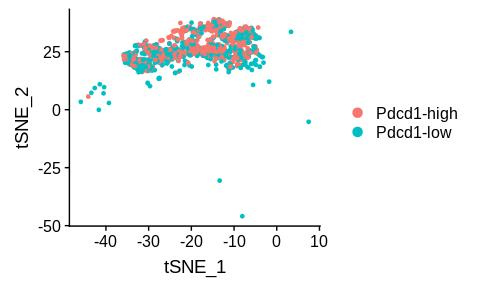

We can also pull out the PD1-high vs low barcodes and perform differential gene expression analysis on them to figure out what other differences are present between the high and low PD1 expressors.

``` r
cd8_pd1_de_genes <- median_split(cd8, "Pdcd1", "differential genes")
head(cd8_pd1_de_genes)
```

    ##                   p_val avg_logFC pct.1 pct.2     p_val_adj
    ## Pdcd1     4.294420e-187 1.1199580 1.000 0.657 7.382108e-183
    ## Gzmf       1.513599e-05 0.5849117 0.303 0.202  2.601877e-01
    ## Ccl4       4.271277e-05 0.3144997 0.885 0.844  7.342325e-01
    ## Serpinb6b  1.204516e-06 0.2672934 0.759 0.653  2.070563e-02
    ## Lag3       4.364076e-07 0.2526700 0.830 0.742  7.501847e-03
    ## Ms4a4b     6.717914e-07 0.2513339 0.965 0.901  1.154809e-02

As expected, we observe that Pdcd1 shows up as a differentially expressed gene that is higher in the PD1-high group. We also observe that other markers of exhaustion such as Lag3 show up as enriched in these cells.

Group-wise analysis
-------------------

So far, we have only been analyzing the cell composition of the dataset as a whole. The dataset is composed of four aggregated samples, ADAR\_S1, ADAR\_S2, Control\_S3, and Control\_S4. The functions were written below to examine the differences between the ADAR1 KO and Control samples.

### 1. Group-wise cell proportion plot

There are different total cell numbers coming from each original sample (e.g. ADAR\_S1 has 1590 total cells, while Control\_S3 has 1674, etc.) Thus, if we want to compare cell composition across samples, we have to normalize for cell count. To do this, we first group by sample, then dividing the number of cells each of that sample's clusters by the total cells in that sample. I wrote the function `get_group_proportions()` below to return the proportion of cells that each cluster represents for each group.

``` r
get_group_proportions <- function (seuratobj, group.by = "active.ident") {
  if (group.by == "active.ident") {
    seuratobj[["active.ident"]] <- seuratobj@active.ident
  }
  # gets the total number of cells within each group
  total_populations <- seuratobj@meta.data %>% group_by(orig.ident) %>% summarize (total.pop = n())
  # gets the proportion of cells for each cell type within a group by dividing by the total
  count_populations <- seuratobj@meta.data %>% group_by_at(vars(group.by, "orig.ident")) %>% summarize (n = n())
  count_populations <- left_join(count_populations, total_populations, by = "orig.ident")
  count_populations <- count_populations %>% mutate (proportion = n/total.pop)
  count_populations
}

get_group_proportions(b16.combined)
```

    ## # A tibble: 36 x 5
    ## # Groups:   active.ident [9]
    ##    active.ident orig.ident     n total.pop proportion
    ##    <fct>        <fct>      <int>     <int>      <dbl>
    ##  1 TAM          ADAR_S1      671      1590     0.422
    ##  2 TAM          ADAR_S2      393      1633     0.241
    ##  3 TAM          Control_S3   790      1674     0.472
    ##  4 TAM          Control_S4  1797      2455     0.732
    ##  5 Monocyte     ADAR_S1      384      1590     0.242
    ##  6 Monocyte     ADAR_S2      655      1633     0.401
    ##  7 Monocyte     Control_S3   386      1674     0.231
    ##  8 Monocyte     Control_S4   217      2455     0.0884
    ##  9 cDC1         ADAR_S1       32      1590     0.0201
    ## 10 cDC1         ADAR_S2       26      1633     0.0159
    ## # … with 26 more rows

We can visualize this information by using the function `plot_group_proportions()` below:

``` r
plot_group_proportions <- function (seuratobj, graph.type = "dodge") {
  # get the proportions using get_group_proportions()
  count_populations <- get_group_proportions(seuratobj)
  # plot the proportions
  if (graph.type == "dodge"){
  ggplot(count_populations, aes (x = active.ident, y = proportion))+
    geom_bar (aes(fill = orig.ident), stat = "identity", position = "dodge")+
      theme(axis.text.x = element_text(angle=45, hjust = 1))
  } else if (graph.type == "stacked") {
  ggplot(count_populations, aes (x = orig.ident, y = proportion))+
    geom_bar (aes(fill = active.ident), stat = "identity", position = "fill")
  }
  else
    print("invalid graph type")
}

plot_group_proportions(b16.combined, graph.type = "dodge")
```

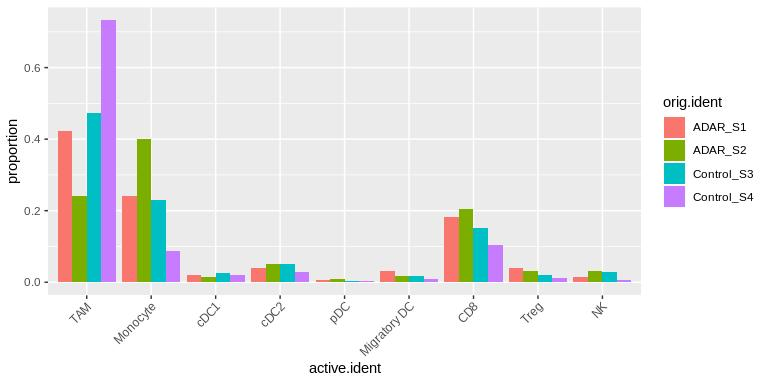

I made the function plot a side-by-side "dodged" barplot by default, but you can specify "stacked" to obtain a stacked barplot instead:

``` r
plot_group_proportions(b16.combined, graph.type = "stacked")
```

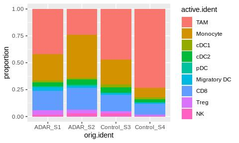

Interestingly, we observe lower amounts of TAMs in the ADAR1 KO samples compared to the control samples, and higher amounts of monocytes and CD8 T cells. Given that there are only two samples per group, the data are relatively noisy. We can get a more in-depth look by analyzing the un-aggregated version of the data, `b16.labeled`:

``` r
plot_group_proportions(b16.labeled)
```

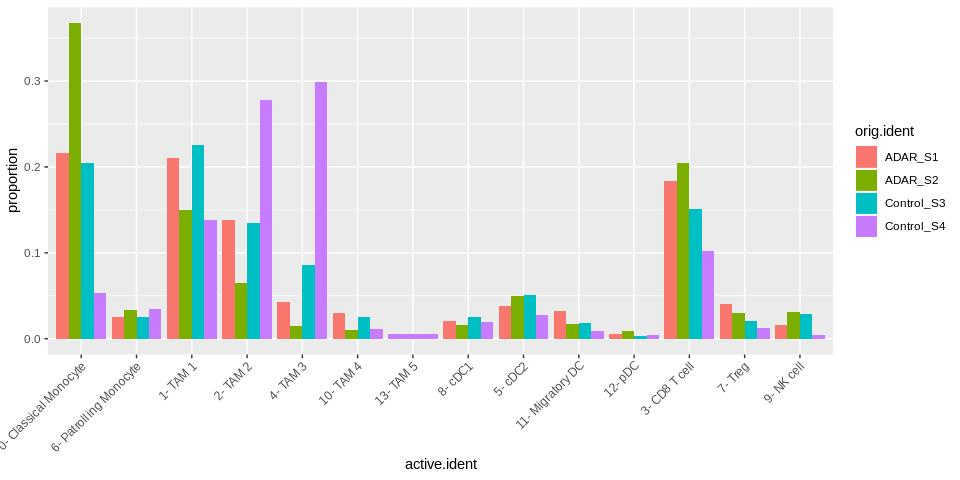

We observe that most of the monocyte changes were due to a drop in the classical monocyte subset in the control samples. It is also interesting that the TAM 2 and TAM 3 populations are much lower in the ADAR1 KO samples than in the Control samples. Looking at the markers specific to these TAM clusters, we observe higher levels of genes such as Arg1, suggesting that loss of ADAR1 is doing something to reduce numbers of this specific subtype of macrophage.

### 2. Heatmap clustering samples / cell types

Now that we have defined the cell composition by sample, we can perform some correlative analysis between samples in order to determine how similar the cell composition of each sample is to one another. This can be achieved by simply using the `cor()` function and plotting a heatmap using `pheatmap::pheatmap()`. We can also visualize which sample has the most of any given cell type by plotting the raw values on the heatmap and scaling by the cell type column.

``` r
plot_heatmap_proportions <- function (seuratobj, graph.type = "by.cell") {
  count_populations <- get_group_proportions(seuratobj)
  reformatted <- count_populations %>% reshape2::dcast(formula = orig.ident~active.ident, value.var = "proportion")
  heatmap_matrix <- as.matrix(reformatted[,-1])
  rownames(heatmap_matrix) <- reformatted[,1]
  if (graph.type == "by.cell") {
    pheatmap::pheatmap(heatmap_matrix, scale = "column")
  } else if (graph.type == "by.sample") {
    pheatmap::pheatmap(cor(t(heatmap_matrix)))
  }
  else
    print("invalid graph type")
}

plot_heatmap_proportions(b16.combined, graph.type = "by.sample")
```

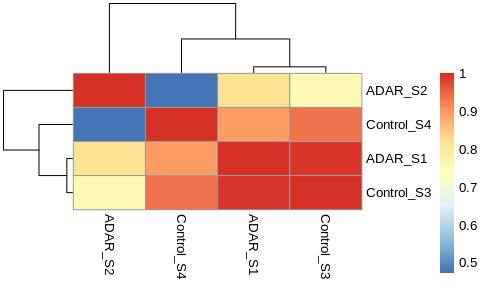

The `by.sample` heatmap surprisingly shows that ADAR\_S1 and Control\_S3 are more similar to each other than the other samples! One would have expected that the two ADAR1 KO samples would cluster together. Looking at the proportion plot from the previous section, the proportion values indeed look very similar across cell types between ADAR\_S1 and Control\_S3.

``` r
plot_heatmap_proportions(b16.combined, graph.type = "by.cell")
```

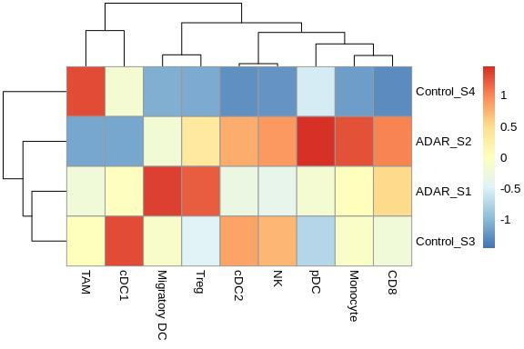

The `by.cell` version of the heatmap allows you to see which samples have the most of any given cell type. For example, Control\_S4 appears to have by far more TAMs than other samples, and Control\_S3 appears to have the highest proportion of cDC1s.

### 3. Median splitting across groups

Similar to the median-split analysis above, this analysis assigns high vs low expression to the cells in the dataset, then calculates the proportion of cells from each group that lie in either the high or low expression category. Below, I wrote the function `proportions_median_split()` to split the data based on the PD1 expression.

``` r
proportions_median_split <- function (seuratobj, gene) {
  # assigns the high or low expression based on median split to the meta.data
  gene_expression <- seuratobj@assays$RNA@data[gene,]
  median_split <- factor (ifelse(gene_expression>=median(gene_expression), str_c(gene,"-high"), str_c(gene,"-low")))
  split_name <- str_c(gene, ".split")
  seuratobj[[split_name]] <- median_split

  # counts the number of high or low expression cells across samples using get_group_proportions()
  count_populations <- get_group_proportions(seuratobj, group.by = split_name)
  count_populations

  # plots the proportions split by group for high vs low expressors
  count_populations %>%
    ggplot(aes_string(x = "orig.ident", y = "proportion"))+
      geom_bar(stat = "identity", aes_string(fill = split_name), position = "dodge")+
    theme(axis.text.x = element_text( size = 10), axis.text.y = element_text(size = 10))+
    labs(x = "", y = "Proportion within group")
}

proportions_median_split(cd8, "Pdcd1")
```

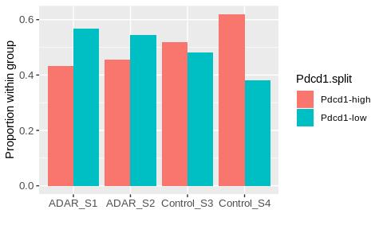

We observe that there are higher propoortions of PD1-low cells in the ADAR1 KO samples compared to the control samples. This is in accord with the activation/exhaustion DotPlot, which also showed that this gene was enriched in the ADAR1 KO samples.

### 4. Differential gene expression analysis between groups

We can use the `FindMarkers()` function in Seurat to find the most differential genes between two groups. Previously, we were looking at cell-type specific markers. Here, we first subset out the cell type of interest, then set the `active.ident` to the ADAR1 KO or Control groups. The "markers" returned by the FindMarkers function, comparing the ADAR1 KO and Control groups, will essentially provide a list of the differentially expressed genes between the two groups. We can loop through the different cell types that we want to perform this analysis on, using the function `get_DE_genes()` below:

``` r
de_groups <- c("CD8", "Monocyte")

get_DE_genes <- function (seuratobj, de_groups) {
  # divide cells into either "ADAR" or "Control"
  seuratobj[["group"]] <-  str_split_fixed(seuratobj@meta.data$orig.ident,"_", 2)[,1]

  # loop through each of the groups you want DE for
  for (item in de_groups) {
    de_subset <- subset(seuratobj, idents = item)
    de_subset <- SetIdent(de_subset, value = "group")
    de_results <- FindMarkers(de_subset, "ADAR", "Control", min.pct = 0.25, logfc.threshold = 0.25)
    write.csv(de_results[ order(de_results$avg_logFC, decreasing = T),], file = paste0(item, "_ADAR_vs_Control_DE.csv"))
  }
}

get_DE_genes(b16.combined,de_groups)
```

``` r
cd8_de <- read.csv("output/CD8_ADAR_vs_Control_DE.csv", header = T, row.names = 1)
head(cd8_de)
```

    ##                 p_val avg_logFC pct.1 pct.2    p_val_adj
    ## Ifi27l2a 8.158212e-50 1.0985523 0.888 0.617 1.402397e-45
    ## Rpl23a   1.365390e-28 0.3951046 0.781 0.585 2.347105e-24
    ## Zbp1     3.833531e-11 0.3591556 0.693 0.569 6.589840e-07
    ## Actb     1.632282e-11 0.3255575 1.000 1.000 2.805893e-07
    ## Hsp90aa1 4.285784e-13 0.3212529 0.962 0.913 7.367263e-09
    ## Rpl9     7.265871e-18 0.2923851 0.875 0.819 1.249003e-13

We find that the ADAR1 KO CD8 T cells have upregulated interferon response genes such as Isg15, among others. It will be interesting to research what these genes may mean in the context of tumor immunology.

### 5. Gene Set Enrichment Analysis (GSEA) across groups

Gene Set Enrichment Analysis is a very useful tool to assess whether pathways consisting of a collection of several genes are enriched in one group compared to another. For example, the interferon gamma response pathway is composed of 200 genes. Although one specific gene in the pathway may not be statistically significant in your differential gene expression analysis, the pathway composed of all of the genes could be significantly enriched. This is useful if you have only subtle changes in your dataset. Typically, GSEA is used to analyze bulk RNA-sequencing samples, but here I will show you how to perform GSEA on scRNAseq samples.

We observed above that the interferon response gene, Isg15, was enriched in the ADAR1 KO samples, but what about the rest of the interferon response genes? I can use GSEA to answer this question.

First, we need to rank all the genes available by their enrichment in the ADAR1 KO samples vs the Control samples (i.e. for every gene, quantify how much higher or lower it is in group A vs group B). Then, we plug this list of genes into either the GSEA application from the Broad Institute (<https://www.gsea-msigdb.org/gsea/index.jsp>), or into the R package `fgsea` from Bioconductor (<https://bioconductor.org/packages/release/bioc/html/fgsea.html>). If you choose to use the GSEA application rather than the R package, the rank files have to be in a very specific format. The genes must be all upper-case, and there can only be a column for the gene name and its corresponding average log-foldchange. Below is some code that will generate rank files that can be used in either application. You can find these files in the `output/` folder of this repo.

``` r
# divide cells into either "ADAR" or "Control"
b16.combined[["group"]] <-  str_split_fixed(b16.combined@meta.data$orig.ident,"_", 2)[,1]

# isolate group of interest, in this case CD8 cells
cd8 <- subset(b16.combined, idents = "CD8")
cd8 <- SetIdent(cd8, value = "group")

# use FindMarkers with min.pct = 0.1, and no logfc threshold to rank all the genes available
cd8_ranked_list <- FindMarkers(cd8, "ADAR", "Control", min.pct = 0.1, logfc.threshold = 0)

# order list, pull out gene name and log2fc, and convert genes to uppercase
cd8_ranked_list <- cd8_ranked_list[order(cd8_ranked_list$avg_logFC, decreasing = T),]
cd8_ranked_list$Gene.name <- str_to_upper(rownames(cd8_ranked_list))
cd8_ranked_list <- cd8_ranked_list[,c("Gene.name", "avg_logFC")]
rownames(cd8_ranked_list) <- NULL

# write to table if want to save for GSEA application
# save(cd8_ranked_list, file = "CD8_ADAR_vs_Control_ranked.Robj")
# write.table(cd8_ranked_list, file = "CD8_ADAR_vs_Control_ranked.rnk", sep = "\t", row.names = F, quote = F)
```

``` r
head(cd8_ranked_list)
```

    ##   Gene.name avg_logFC
    ## 1  IFI27L2A 1.0985523
    ## 2      XCL1 0.8031340
    ## 3      GZMA 0.4045709
    ## 4    RPL23A 0.3951046
    ## 5      ZBP1 0.3591556
    ## 6      ACTB 0.3255575

Now that we have the ranked list, we can plug it into either the GSEA application or into the fgsea package. Below, I will show you how to use the `fgsea` package. First, we have to download the pathway files from the GSEA MSigDB webpage at: <https://www.gsea-msigdb.org/gsea/msigdb/collections.jsp> and load them in using `fgsea::gmtPathways()`. A commonly-used set of pathways is the HALLMARK pathway set, which I will use below.

``` r
library(fgsea)
```

``` r
# read in file containing lists of genes for each pathway
hallmark_pathway <- gmtPathways("pathway_files/h.all.v7.0.symbols.gmt.txt")
head(names(hallmark_pathway))
```

    ## [1] "HALLMARK_TNFA_SIGNALING_VIA_NFKB"   
    ## [2] "HALLMARK_HYPOXIA"                   
    ## [3] "HALLMARK_CHOLESTEROL_HOMEOSTASIS"   
    ## [4] "HALLMARK_MITOTIC_SPINDLE"           
    ## [5] "HALLMARK_WNT_BETA_CATENIN_SIGNALING"
    ## [6] "HALLMARK_TGF_BETA_SIGNALING"

Then, we have to turn our ranked list into a vector in which the `avg_logFC` is named with the gene name, as well as get rid of any NA values or duplicate gene entries.

``` r
# formats the ranked list for the fgsea() function
prepare_ranked_list <- function(ranked_list) {
  # if duplicate gene names present, average the values
  if( sum(duplicated(ranked_list$Gene.name)) > 0) {
    ranked_list <- aggregate(.~Gene.name, FUN = mean, data = ranked_list)
    ranked_list <- ranked_list[order(ranked_list$avg_logFC, decreasing = T),]
  }
  # omit rows with NA values
  ranked_list <- na.omit(ranked_list)
  # turn the dataframe into a named vector
  ranked_list <- tibble::deframe(ranked_list)
  ranked_list
}

cd8_ranked_list <- prepare_ranked_list(cd8_ranked_list)
head(cd8_ranked_list)
```

    ##  IFI27L2A      XCL1      GZMA    RPL23A      ZBP1      ACTB
    ## 1.0985523 0.8031340 0.4045709 0.3951046 0.3591556 0.3255575

Now that we have a cleaned-up vector of avg\_logFC named by gene, we can plug it into the `fgsea::fgsea()` function along with the hallmark pathway object, which generates a table of results containing the enrichment scores associated with each pathway:

``` r
# generate GSEA result table using fgsea() by inputting the pathway list and ranked list
fgsea_results <- fgsea(pathways = hallmark_pathway,
                  stats = cd8_ranked_list,
                  minSize = 15,
                  maxSize = 500,
                  nperm= 1000)

fgsea_results %>% arrange (desc(NES)) %>% select (pathway, padj, NES) %>% head()
```

    ##                              pathway       padj      NES
    ## 1 HALLMARK_INTERFERON_GAMMA_RESPONSE 0.01495017 2.253596
    ## 2 HALLMARK_INTERFERON_ALPHA_RESPONSE 0.01495017 2.164319
    ## 3            HALLMARK_MYC_TARGETS_V1 0.01495017 2.145742
    ## 4               HALLMARK_E2F_TARGETS 0.01495017 2.031306
    ## 5            HALLMARK_G2M_CHECKPOINT 0.01495017 1.798625
    ## 6            HALLMARK_MYC_TARGETS_V2 0.02142857 1.746530

The enrichment scores (ES) and normalized enrichment scores (NES) tell us how much more the collection of genes in that pathway are expressed in the ADAR1 KO samples vs the Control samples. In this case, we observe that the most enriched pathway in the ADAR1 KO group is the interferon gamma response pathway.

We can plot enrichment curves for individual pathways using the built-in `fgsea::plotEnrichment()` function, which I've written a small wrapper for below. In these plots, the black ticks on the x-axis indicate a gene in the pathway, and the green curve is a measure of how enriched the genes are for either the ADAR1 KO group (left side) or the Control group (right side). An example of the interferon gamma response pathway is below.

``` r
plot_enrichment <- function (geneset, pathway, ranked_list) {
  plotEnrichment(geneset[[pathway]], ranked_list)+labs (title = pathway)
}

# example of pathway highly enriched in ADAR
plot_enrichment(hallmark_pathway, "HALLMARK_INTERFERON_GAMMA_RESPONSE" , cd8_ranked_list)
```


As a comparison, I've also plotted the IL2 STAT5 signaling pathway, which is highly enriched in the opposite direction (towards the control samples).

``` r
# example of pathway enriched in Control
plot_enrichment(hallmark_pathway,"HALLMARK_IL2_STAT5_SIGNALING", cd8_ranked_list)
```

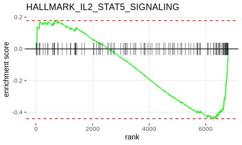

The `fsgea_results` table above is useful, but it would be nicer to view in a more graphical format. Below, we construct a "waterfall" plot using the function `waterfall_plot()`, which is basically a sideways bar plot of enrichment scores for each of the pathways. The significantly enriched pathways are highlighted in a different color.

``` r
waterfall_plot <- function (fsgea_results, graph_title) {
  fgsea_results %>%
    mutate(short_name = str_split_fixed(pathway, "_",2)[,2])%>%
    ggplot( aes(reorder(short_name,NES), NES)) +
      geom_bar(stat= "identity", aes(fill = padj<0.05))+
      coord_flip()+
      labs(x = "Hallmark Pathway", y = "Normalized Enrichment Score", title = graph_title)+
      theme(axis.text.y = element_text(size = 7),
            plot.title = element_text(hjust = 1))
}

waterfall_plot(fgsea_results, "Pathways enriched in ADAR1 KO vs Control CD8 T cells")
```

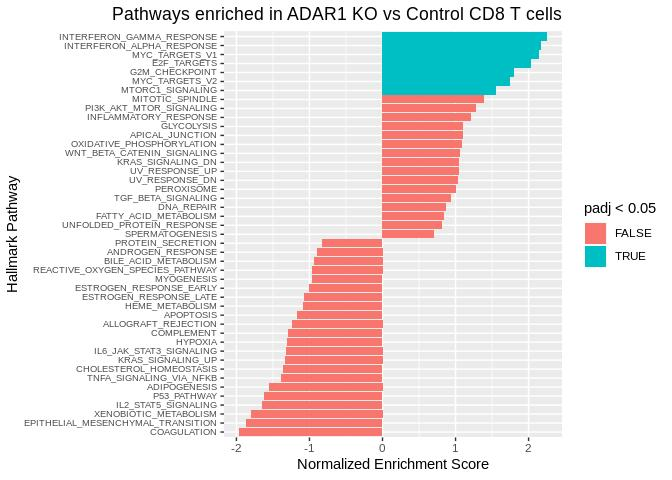

Using this visualization, it is easy to quickly identify the significantly enriched pathways. It is interesting to note that both the interferon alpha response and interferon gamma response pathways are significant, as well as both of the MYC targets pathways.

------------------------------------------------------------------------

Conclusions
-----------

Based on the analysis above, we can make some overall conclusions about the TME of the b16 melanoma model as well as what effects ADAR1 KO may have on cellular composition and phenotype.

-   The b16 model is heavily infiltrated by cells of myeloid origin compared to lymphoid origin. In particular, there are high levels of macrophages (C1q+, APOE+, and Ms4a7+ cells).
-   The cell types present are very diverse, and include macrophages with varying phenotypes, different subpopulations of dendritic cells (cDC1, cDC2, pDC, and Migratory DCs), as well multiple types of T cells (CD8+ T cells and T-regulatory cells). It will be interesting to compare the composition of the b16 melanoma model with other mouse tumor models.
-   In the ADAR1 KO samples, CD8 T cells are increased in frequency compared to the Control samples. Interestingly, there is a decrease in Arg1+ macrophages and an increase in classical monocytes in the ADAR1 KO samples, as well as a slight increase in numbers of T-regulatory cells.
-   There is an enrichment of interferon gamma response pathways in CD8 T cells from ADAR1 KO samples compared to Control samples, suggesting a heightened/more cytotoxic inflammatory response is occuring in the ADAR1 KO tumors.

There are many more insights to be gained from mining this dataset, and we are just scratching the surface here. I hope that my analysis pipeline and visualization techniques will help those of you out there analyze your own single-cell RNA-sequencing experiments.
